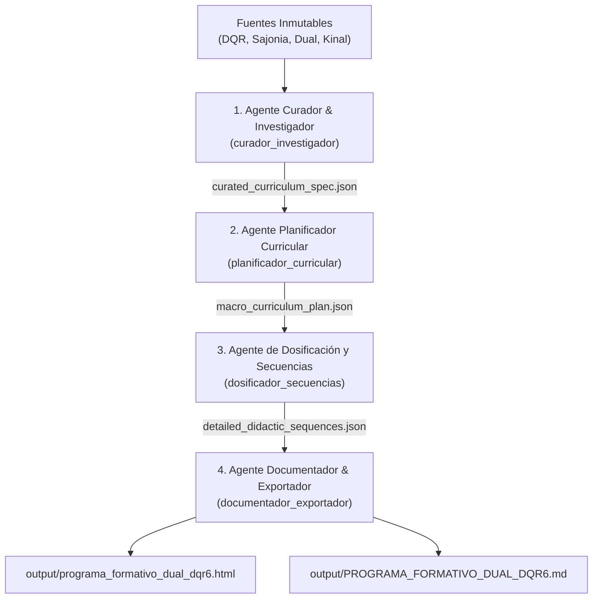

# Diseño Curricular Dual y Pipeline Multi-Agente (Google Antigravity)

Bienvenido al espacio de trabajo para el **Diseño Curricular y Didáctico Técnico-Profesional y Dual**, fundamentado rigurosamente en los estándares del **Marco Alemán de Cualificaciones (DQR)**, el **Sistema Dual de Formación en Alternancia** y el marco institucional de **Fundación Kinal**.

Este proyecto está configurado bajo una arquitectura **100% Zero-Install** (sin instalaciones locales en el sistema operativo), aprovechando el motor nativo de habilidades y subagentes de Antigravity.

---

## 1. Estructura del Espacio de Trabajo

```text
Diseño Instruccional/
├── .agents/
│   └── skills/
│       └── curriculum-didactic-designer/
│           ├── SKILL.md                                  # Manifiesto y reglas operativas de la Skill
│           ├── references/
│           │   └── curricular_map_and_sources.md         # Base inmutable de conocimiento y citas textuales
│           └── resources/
│               └── document_templates.html               # Plantillas visuales en HTML limpio y tablas maestras
│
├── pipeline/
│   ├── curated_curriculum_spec.json                      # Fase 1: Especificación curricular curada
│   ├── macro_curriculum_plan.json                        # Fase 2: Plan macrocurricular (1,200 hrs DQR 6)
│   └── detailed_didactic_sequences.json                  # Fase 3: Secuencia didáctica dosificada (Inicio-Desarrollo-Cierre)
│
├── output/
│   ├── programa_formativo_dual_dqr6.html                 # Documento final formateado en HTML para Google Docs / Impresión
│   └── PROGRAMA_FORMATIVO_DUAL_DQR6.md                   # Documento maestro en formato Markdown
│
├── scripts/                                              # Scripts de automatización, generación de Word y portales web
│
└── README.md                                             # Guía técnica y de operación del sistema
```

---

## 2. Pipeline Multi-Agente

El flujo pedagógico opera en 4 fases secuenciales orquestadas por subagentes especializados:



### Roles de los Subagentes:
1. **`curador_investigador`**: Audita, extrae y normaliza las entidades pedagógicas asegurando fidelidad absoluta a las fuentes del cuaderno.
2. **`planificador_curricular`**: Estructura la macro-dosificación (1,200 horas pedagógicas para DQR 6: 400h aula / 800h empresa) y define los hitos de evaluación integrada.
3. **`dosificador_secuencias`**: Diseña el microdiseño didáctico de cada sesión en tres momentos (Apertura 20 min, Desarrollo 60 min, Cierre 20 min) vinculando la práctica AEVO, el *Berichtsheft* y los valores del trabajo bien hecho.
4. **`documentador_exportador`**: Ensambla y exporta los artefactos JSON en un documento unificado con estilos HTML rigurosos y Markdown legible.

---

## 3. Citas Textuales y Parámetros Obligatorios

* **Formación Profesional Dual:**
  > *"concepto de aprendizaje para jóvenes que tiene como objetivo preparar a los aprendices para su vida profesional, por lo que la formación se realiza en régimen de alternancia entre la escuela o el centro de formación y la empresa. El aprender en el proceso del trabajo es base y a la vez objetivo de la acción formativa".*
* **Concepto de Competencia en el DQR:**
  > *"the ability and readiness of the individual to use knowledge, skills and personal, social and methodological competences and to behave in a considered, individual and socially responsible manner. Competence is understood in this sense as the comprehensive ability to act".*
* **Misión de Kinal:**
  > *"Formar a jóvenes y adultos a través de una educación integral, con énfasis en las áreas técnicas y tecnológicas, influyendo positivamente en su trabajo, su familia y la sociedad".*
* **Valores de Kinal:**
  > *"Visión cristiana de la vida. Respeto a la dignidad de la persona. Espíritu de servicio. Trabajo bien hecho. Libertad personal responsable".*
* **Umbral Aprobatorio:** Nota mínima de **75 puntos sobre 100** en cursos regulares y exámenes por suficiencia (en inglés, suficiencia vía prueba **ELASH II** nivel **A2**).
* **Carga DQR 6:** **1,200 horas pedagógicas** con alternancia teoría en aula (*Berufsschule*) y práctica en el puesto (*Ausbildung am Arbeitsplatz*).

---

## 4. Cómo Usar Este Espacio de Trabajo

1. **Consultar o visualizar los entregables:**
   * Abre [`output/programa_formativo_dual_dqr6.html`](./output/programa_formativo_dual_dqr6.html) en tu navegador para ver la maquetación visual con tablas y formato oficial.
   * Abre [`output/PROGRAMA_FORMATIVO_DUAL_DQR6.md`](./output/PROGRAMA_FORMATIVO_DUAL_DQR6.md) para lectura rápida o edición en Markdown.
2. **Generar nuevos módulos o cursos:**
   * Simplemente solicita al asistente en el chat: *"Diseña una nueva secuencia didáctica para el Módulo 2"* o *"Genera una dosificación para el nivel DQR 5 (400 horas)"*. Antigravity activará automáticamente la skill `curriculum-didactic-designer` y sus subagentes.
